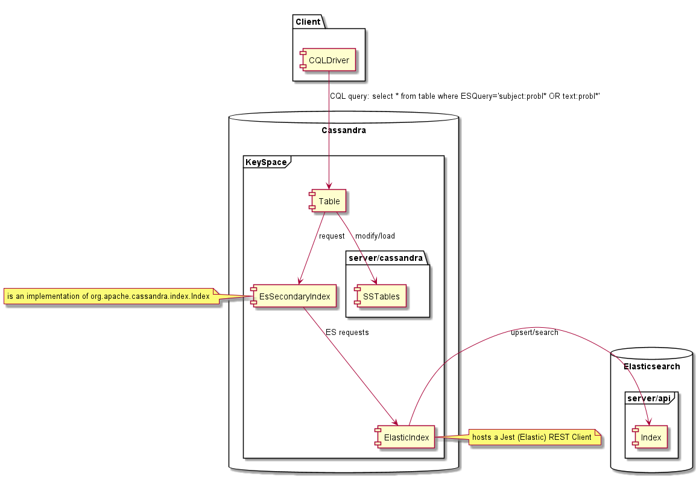
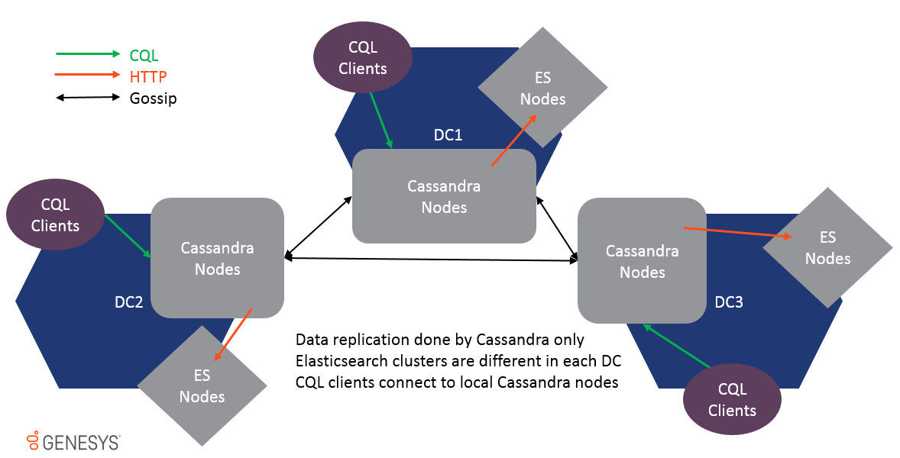
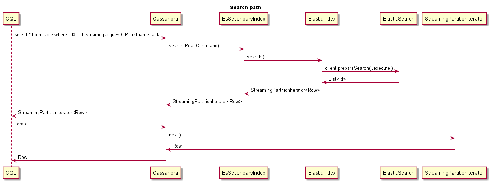
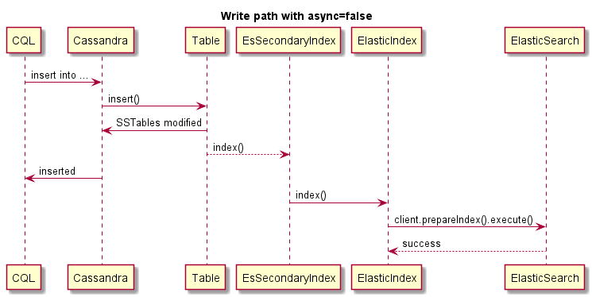
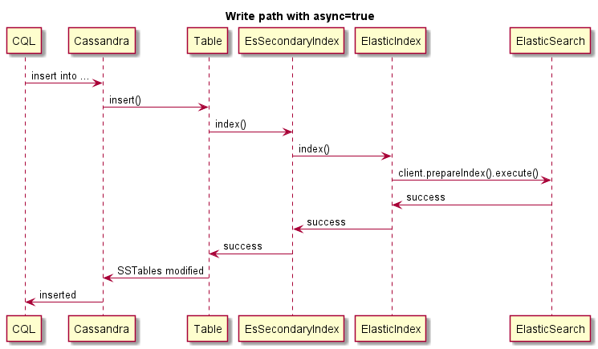
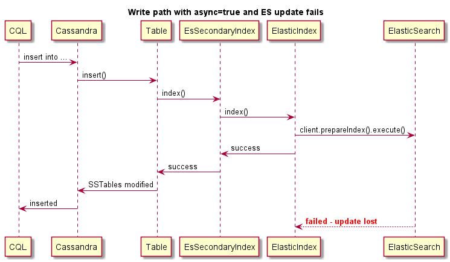

<!-- TOC depthFrom:1 depthTo:6 withLinks:1 updateOnSave:1 orderedList:0 -->

- [Introduction](#introduction)
- [Supported Versions](#supported-versions)
- [Distribution](#distribution)
	- [Building from sources](#building-from-sources)
	- [Using Maven](#using-maven)
	- [Installing the plugin in Cassandra](#installing-the-plugin-in-cassandra)
	- [Upgrade of an existing version](#upgrade-of-an-existing-version)
- [User Guide](#user-guide)
	- [Limitations](#limitations)
		- [Tables with Clustering Keys](#tables-with-clustering-keys)
		- [Cell/Column TTL vs Row TTL](#cellcolumn-ttl-vs-row-ttl)
		- [Multiple Indexes on the Same Table](#multiple-indexes-on-the-same-table)
	- [Getting Started](#getting-started)
	- [Index Configuration](#index-configuration)
		- [Multi-Datacenter Support](#multi-datacenter-support)
		- [Support for Authentication](#support-for-authentication)
		- [Support for HTTPS](#support-for-https)
		- [Analytic mode](#analytic-mode)
		- [Index Options](#index-options)
			- [Setting options using CREATE CUSTOM INDEX](#setting-options-using-create-custom-index)
			- [Setting options using environment variables or system properties](#setting-options-using-environment-variables-or-system-properties)
			- [Setting options using a file](#setting-options-using-a-file)
			- [Options Definitions](#options-definitions)
				- [Option examples](#option-examples)
					- [json-flat-serialized-fields](#json-flat-serialized-fields)
					- [index-manager](#index-manager)
					- [mapping-`<type>`](#mapping-type)
	- [Index Search Queries](#index-search-queries)
		- [For best performance](#for-best-performance)
		- [Fake Row Loading for Large ResultSet](#fake-row-loading-for-large-resultset)
		- [Elasticsearch Metadata](#elasticsearch-metadata)
	- [Index segmentation](#index-segmentation)
	- [TTL Support](#ttl-support)
	- [Performance Tracing](#performance-tracing)
- [Sequence Diagrams](#sequence-diagrams)
- [Changes](#changes)
	- [Version 9.1.001](#version-91001)
	- [Version 9.1.000](#version-91000)
	- [Version 9.0.000](#version-90000)

<!-- /TOC -->
# Introduction
This documentation explains usage and configuration of "ESIndex" that is a Elasticsearch based secondary index for Cassandra.

This plugin requires an Elasticsearch (ES) cluster already configured.

The plugin will install in a regular Cassandra 3.11.x release downloaded from http://cassandra.apache.org/.
There is nothing to change in Cassandra configuration files to support the index.
Cassandra’s behaviour remains unchanged for applications that do not use the index.

Once created on a Cassandra table, this index allows to perform "Full Text Search" Elasticsearch queries on Cassandra using CQL and
return matching rows from Cassandra data. The usage of this plugin does not require changing Cassandra source code, we have implemented the
ElasticSearch index for Cassandra using:
* Cassandra interfaces: [Index](https://github.com/apache/cassandra/blob/cassandra-3.11/src/java/org/apache/cassandra/index/Index.java)
* Cassandra API: [CQL](http://cassandra.apache.org/doc/latest/cql/indexes.html)




# Supported Versions
Tested versions are Elasticsearch 5.x, 6.x and Cassandra 3.11.x. However the plugin may also work with different Elasticsearch versions
(1.7, 2.x 5.x, 6.x) if the application provides the corresponding mappings and options.
Other versions of Apache Cassandra like 3.0, 2.2 or 4.0 are not supported as the secondary index interface used by the plugin is different.
Other Cassandra vendors are not tested, ScyllaDB is not supported.

| Versions | Elasticsearch 1.x | Elasticsearch 2.x | Elasticsearch 5.x | Elasticsearch  6.x |
|---|---|---|---|---|
| Cassandra 2.x | No | No | No | No |
| Cassandra 3.x  | No | No | No | No |
| Cassandra 3.11.x  |  Limited | Limited | Yes | Yes |
| Cassandra 4.x  | No | No | No | No |

* **No**: Plugin can't work due to different Cassandra interface.
* **Yes**: Plugin works without problem.
* **Limited**: Plugin should work but testing is limited.

# Distribution

## Building from sources
This project requires Maven and compiles with Java 8. To build the plugin, at the root of the project execute:
> mvn clean package

This will build a "all in one jar' in `target/distribution/lib4cassandra`

## Using Maven
```
<dependency>
  <groupId>com.genesyslab</groupId>
  <artifactId>es-index</artifactId>
  <version>9.1.002.00</version>
</dependency>
```
See [Github Package](https://github.com/GenesysPureEngagePremise/cassandra-es-index/packages)

See [Maven repository](https://mvnrepository.com/artifact/com.genesys/es-index/9.1.002.00)

## Installing the plugin in Cassandra
Put `es-index-9.1.000.xx-jar-with-dependencies.jar` in the lib folder of Cassandra along with other Cassandra jars,
for example '/usr/share/cassandra/lib' on all Cassandra nodes. Start or restart your Cassandra node(s).

## Upgrade of an existing version
1. Stop Cassandra node.
2. Remove old es-index-9.1.001.\<v1>-jar-with-dependencies.jar
3. Add new es-index-9.1.001.\<v2>-jar-with-dependencies.jar
4. Start Cassandra node.
5. Proceed to next node.

# User Guide

## Limitations

### Tables with Clustering Keys
Due to lack of testing, tables with clustering keys are not supported. Only a partition key is supported, composite partition keys should
work but were not extensively tested.

### Cell/Column TTL vs Row TTL
EsIndex only supports row level TTL where all the cells will expire at the same time and corresponding ES document can be deleted at the
same time. If a row have cells that expires at different times, the corresponding document will be deleted when the last cell expires.
If using different cell TTL, the data returned from a search will still be consistent as data is read from SSTables, but it will still be
possible to find the row using expired data using an ES query.   

### Multiple Indexes on the Same Table
It is possible to create several indexes on the same table, EsIndex will not prevent that. However if more than one EsIndex exists the
behavior can be inconsistent, such configuration is not supported. The CQLSH command 'describe table \<ks.tableName>' can be used to show
indexes created on the table and drop them if necessary.

For sake of simplicity, create this keyspace first:
```
CREATE KEYSPACE genesys WITH replication = {'class': 'SimpleStrategy', 'replication_factor': 1}
```

## Getting Started
Let's use below table as an example:
```
CREATE TABLE genesys.emails (
   id UUID PRIMARY KEY,
   subject text,
   body text,
   userid int,
   query text
);  
```

You need to dedicate a dummy text column for index usage.
This column must never receive data. In this example, `query` column is the dummy column.

Here is how to create the index for the example table and use **eshost** for Elasticsearch:
```
CREATE CUSTOM INDEX ON genesys.emails(query)
USING 'com.genesyslab.webme.commons.index.EsSecondaryIndex'
WITH OPTIONS = {'unicast-hosts': 'eshost:9200'};
```

For example, if your Elasticsearch server is listening on `localhost`, replace **eshost** with **localhost**.

Errors returned by CQL are very limited, if something goes wrong, like your Elasticsearch host unavailable
you'll get a timeout or another kind of exception. You'll have to check Cassandra logs to understand what went wrong.

We didn't provide any mapping so we're relying on Elasticsearch dynamic mapping, let's insert some data:
```
INSERT INTO genesys.emails (id, subject, body, userid)
VALUES (904b88b2-9c61-4539-952e-c179a3805b22, 'Hello world', 'Cassandra is great, but it''s even better with EsIndex and Elasticsearch', 42);
```

You can see that index is being created in Elasticsearch if you have the access to logs:

```
[o.e.c.m.MetaDataCreateIndexService] [node-1] [genesys_emails_index@] creating index, cause [api], templates [], shards [5]/[1], mappings []
[INFO ][o.e.c.m.MetaDataMappingService] [node-1] [genesys_emails_index@/waSGrPvkQvyQoUEiwqKN3w] create_mapping [emails]
```

Now we can search Cassandra using Elasticsearch via the index, here is a Lucene syntax search:

```
select id, subject, body, userid, query  from emails where query='body:cassan*';

 id                                   | subject     | body                                                                    | userid | query
--------------------------------------+-------------+-------------------------------------------------------------------------+--------+-------
 904b88b2-9c61-4539-952e-c179a3805b22 | Hello world | Cassandra is great, but it's even better with EsIndex and Elasticsearch |     42 |
 {
	"_index": "genesys_emails_index@",
	"_type": "emails",
	"_id": "904b88b2-9c61-4539-952e-c179a3805b22",
	"_score": 0.24257512,
	"_source": {
		"id": "904b88b2-9c61-4539-952e-c179a3805b22"
	},
	"took": 4,
	"timed_out": false,
	"_shards": {
		"total": 5,
		"successful": 5,
		"failed": 0
	},
	"hits": {
		"total": 1,
		"max_score": 0.24257512
	}
}

(1 rows)
```

 (json was formatted)

 All rows will contain data from Cassandra loaded from SSTables using the CQL consistency.
 Data in the 'query' column is the metadata returned by Elasticsearch.

 Here is how to query Elasticsearch to check the generated mapping:
 `GET http://eshost:9200/genesys_emails_index@/emails/_mapping?pretty`
```json
{
  "genesys_emails_index@" : {
    "mappings" : {
      "emails" : {
        "properties" : {
          "IndexationDate" : {
            "type" : "date"
          },
          "_cassandraTtl" : {
            "type" : "long"
          },
          "body" : {
            "type" : "text",
            "fields" : {
              "keyword" : {
                "type" : "keyword",
                "ignore_above" : 256
              }
            }
          },
          "id" : {
            "type" : "text",
            "fields" : {
              "keyword" : {
                "type" : "keyword",
                "ignore_above" : 256
              }
            }
          },
          "subject" : {
            "type" : "text",
            "fields" : {
              "keyword" : {
                "type" : "keyword",
                "ignore_above" : 256
              }
            }
          },
          "userid" : {
            "type" : "text",
            "fields" : {
              "keyword" : {
                "type" : "keyword",
                "ignore_above" : 256
              }
            }
          }
        }
      }
    }
  }
}
```

The EsIndex plugin added two fields:
* IndexationDate is the date of the last update of the document
* _cassandraTtl is the epoch time when row will be TTLed (in 19 years by default)

We can see that the mapping looks fine, but Elasticsearch didn't notice that userId is an integer and added fields[keyword] to all text.  
Here is how the data looks like in Elasticsearch:


`GET http://localhost:9200/genesys_emails_index@/emails/_search?pretty&q=body:cassandra`

```json
{
  "took" : 2,
  "timed_out" : false,
  "_shards" : {
    "total" : 5,
    "successful" : 5,
    "skipped" : 0,
    "failed" : 0
  },
  "hits" : {
    "total" : 1,
    "max_score" : 0.2876821,
    "hits" : [
      {
        "_index" : "genesys_emails_index@",
        "_type" : "emails",
        "_id" : "904b88b2-9c61-4539-952e-c179a3805b22",
        "_score" : 0.2876821,
        "_source" : {
          "id" : "904b88b2-9c61-4539-952e-c179a3805b22",
          "body" : "Cassandra is great, but it's even better with EsIndex and Elasticsearch",
          "subject" : "Hello world",
          "userid" : "42",
          "IndexationDate" : "2019-01-15T16:53:00.107Z",
          "_cassandraTtl" : 2147483647
        }
      }
    ]
  }
}
```

Let's fix the mapping by dropping the index:
`drop index genesys.emails_query_idx;`
This will also drop Elasticsearch index AND data!

and recreate it with a proper mapping:
```
CREATE CUSTOM INDEX ON genesys.emails(query)
USING 'com.genesyslab.webme.commons.index.EsSecondaryIndex'
WITH OPTIONS = {
    'unicast-hosts': 'localhost:9200',
    'mapping-emails': '
        {
           "emails":{
              "date_detection":false,
              "numeric_detection":false,
              "properties":{
                 "id":{
                    "type":"keyword"
                 },
                 "userid":{
                    "type":"long"
                 },
                 "subject":{
                    "type":"text",
                    "fields":{
                       "keyword":{
                          "type":"keyword",
                          "ignore_above":256
                       }
                    }
                 },
                 "body":{
                    "type":"text"
                 },
                 "IndexationDate":{
                    "type":"date",
                    "format":"yyyy-MM-dd''T''HH:mm:ss.SSS''Z''"
                 },
                 "_cassandraTtl":{
                    "type":"long"
                 }
              }
           }
        }
    '};
```
This will create a new index will provided mapping and reindex the data that is in Cassandra.

Here is the resulting ES mapping:
```json
{
  "genesys_emails_index@" : {
    "mappings" : {
      "emails" : {
        "date_detection" : false,
        "numeric_detection" : false,
        "properties" : {
          "IndexationDate" : {
            "type" : "date",
            "format" : "yyyy-MM-dd'T'HH:mm:ss.SSS'Z'"
          },
          "_cassandraTtl" : {
            "type" : "long"
          },
          "body" : {
            "type" : "text"
          },
          "id" : {
            "type" : "keyword"
          },
          "subject" : {
            "type" : "text",
            "fields" : {
              "keyword" : {
                "type" : "keyword",
                "ignore_above" : 256
              }
            }
          },
          "userid" : {
            "type" : "long"
          }
        }
      }
    }
  }
}
```

Now that mapping is properly defined, we can search _userid_ as a number. In this example we're using Elasticsearch query DSL:
```
select id, subject, body, userid from genesys.emails
where query='{"query":{"range":{"userid":{"gte":10,"lte":50}}}}';

@ Row 1
---------+-------------------------------------------------------------------------
 id      | 904b88b2-9c61-4539-952e-c179a3805b22
 subject | Hello world
 body    | Cassandra is great, but it's even better with EsIndex and Elasticsearch
 userid  | 42
```

It is very important to get the mapping right before starting production. Reindexing a large table will take a lot of time and will put
significant load on Cassandra and Elasticsearch. You'll need to check Cassandra logs for errors in your ES mapping. Make sure to escape
single quotes (') by doubling them in the JSON options provided to the CREATE INDEX command.

## Index Configuration
Below are all options related to the configuration of ElasticSearch index.
Key names can use hyphen '-' char, or dots. For example both names will work:

* async.write
* async-write

Note that all below options are specific to Genesys implementation and not Elasticsearch itself.

**If Jest classes are not found, DUMMY mode is enabled and no other cases applies.**


### Multi-Datacenter Support
Multi-Datacenter is supported and data is replicated via Cassandra gossip replication only. ES clusters on different DCs are not the same
and should never be joined together or performance will be impacted. Since data is replicated at the table level, EsIndex will get an
update in each DC and local ES Cluster will be updated as well.



To support multi-DC, all options can be prefixed by Datacenter and Rack name to make settings location specific, for example:
* **option-name**: applies to all Cassandra nodes
* **&lt;paris&gt;.option-name**: applies to all Cassandra nodes running in the "paris" DC.
* **&lt;paris.rack1&gt;.option-name**: applies to all Cassandra nodes running in the "paris" DC and rack1.

### Support for Authentication
To provide Cassandra index for Elasticsearch with credentials, each node must have the environment variable **ESCREDENTIALS** correctly set
before starting. This must be set on all Cassandra hosts.

The below example provides the password for the user 'elastic' and password 'examplepassword' separated by : (colon) character.
It can be done either directly in the system as an environment variable or in the shortcut that launches Cassandra.

**ESCREDENTIALS = elastic:examplepassword**
Once the index is successfully initialized, it will write "Elasticsearch credentials provided" in Cassandra logs at info level.
Once this message is output it is possible to clear the environment variable. If Cassandra is restarted the environment variable must
be set again before starting. The credentials are kept in memory only and are not saved anywhere else. If user and/or password is changed,
all Cassandra nodes must be restarted with the updated environment variable value.

### Support for HTTPS
In the index options set

unicast-hosts = **https**:`//<host name>:9200`

It is currently not possible to migrate an existing index from http to https, usage of one or another must be decided before
you create the Cassandra schema. In order to ease HTTPS deployment, the index will automatically trust all HTTPS certificates.


### Analytic mode
It is possible to keep data on ElasticSearch's side for a longer period time than defined Cassandra TTL.
This mode is turned using es-analytic-mode option. When the option is enabled ElasticIndex will skip all delete operations.

To keep data from growing too much on ES side, it's advised to use ttl-shift and force-delete settings.


### Index Options
When creating the index you will be providing index options, as well as Elasticsearch index options using 'USING OPTION' CQL command.


#### Setting options using CREATE CUSTOM INDEX
Index options should be specified at index creation, here is an example
```
CREATE CUSTOM INDEX on genesys.email(query) using 'com.genesyslab.webme.commons.index.EsSecondaryIndex' WITH options =
{
   'read-consistency-level':'QUORUM',
   'insert-only':'false',
   'index-properties': '{
       "index.analysis.analyzer.dashless.tokenizer":"dash-ex",
       "index.analysis.tokenizer.dash-ex.pattern":"[^\\\\w\\\\-]\",
       "index.analysis.tokenizer.dash-ex.type":"pattern"
   }',
   'mapping-email': '{
         "email": {
           "dynamic": "false",
           "properties": {
               "subject" : {
                   "type" : "text",
                   "fields" : {
                     "keyword" : {
                       "type" : "keyword",
                       "ignore_above" : 256
                     }
                   }
                }
         }
       }',
   'discard-nulls':'false',
   'async-search':'true',
   'async-write':'false'
};
```

#### Setting options using environment variables or system properties
You can also set or override options using environment variables or Java system properties by prefixing options with 'genesys-es-'.

* **genesys-es-<option-name>** Default values can be set at host level using environment variables or system properties
* **genesys-es-unicast-hosts** For example, this allows to control ES host names on DB side so that client don't have to know ES host names

#### Setting options using a file
Options provided in the "CREATE CUSTOM INDEX" command are used first.
They can be locally overridden using a file named **es-index.properties** found in ".", "./conf/", "../conf/" or "./bin/".
(can be changed with -Dgenesys-es-esi-file or -Dgenesys.es.esi.file system property)

Here is an example for the content of the file:
> insert-only=true
> discard-nulls=false
> async-write=false

#### Options Definitions

Name | Default | Description
------------ | ------------- | -------------
max-results | 10000 | Number of results to read from ES searches to load Cassandra rows.
read-consistency-level | ONE | Used for searches, this consistency-level is used to load Cassandra rows.
insert-only | false	 | By default ESIndex will use upsert operations. In insert only mode data will always be overwritten.
async-write | true	 | Sends index updates asynchronously without checking for correct execution. This provides much faster writes but data may become inconsistent if ES cluster is not available, because writes won't fail. Default is true.
segment | OFF | OFF, HOUR, DAY, MONTH, YEAR, CUSTOM Automatic index segmentation is controlled by this setting. If set to DAY, every day a new index will be created under the alias. Note that empty indexes are deleted automatically every hour. Note: HOUR setting is discouraged as it will create many indexes and may decrease performance. This setting is advised for development and testing purposes.
segment-name | | If segment=CUSTOM this value will be used for the new index creation.
mapping-\<type> | {} | For each secondary index, the table name is passed as a type, for example mapping-visit={json definition}.
unicast-hosts | http://localhost:9200 | A comma separated list of host, can be host1,host2,host3 or http://host1,http://host2,http://host3 or http://host1:9200,http://host2:9200,http://host3:9200. If protocol or port are missing http and 9200 assumed. It is possible to use https.
discard-nulls | **true** | Do not pass null values to ES index, it means you won't be able to delete a value. **Default is true**.
index-properties | {} | Properties as a JSON string, passed to create a new index, may contain tokenizer definitions for example.
json-serialized-fields | {}	| A coma separated string defining that a string column must be indexed as a JSON string. Non-JSON parsable strings will prevent inserts in Cassandra.
json-flat-serialized-fields | {} | A coma separated string defining that a string column must be indexed as a type-safe JSON document. Elasticsearch json mapping does not allow to index a value that will change type over time. For example {"key":"value"} can't become {"key":{"subkey":"value"}} in Elasticsearch you'll get a mapping exception. Such JSON-flat will be converter into a JSON object that have string keys and arrays of string as values.
dummy | false | Completely disables secondary index. Note that if Jest classes are not found the index will be put into dummy mode automatically.
validate-queries | false | Sends search queries to ES for validation in order to provide meaningful syntax errors instead of Cassandra timeouts.
concurrent-lock | true | Locks index executions on partition id. This prevents concurrency problems when dealing with multiple updates on the same partition at the same time.
skip-log-replay | true | When a Cassandra nodes starts it will replay the commit log, those updates are skipped to improve startup time as they have already be applied to ES.
skip-non-local-updates | true | To improve performance enabling this setting will only execute index updates on the master replica of the token range.
es-analytic-mode	 | false  | Disables deletes (TTL or delete from) of the ES documents.
type-pipelines	 | none | List of type to setup pipelines.
pipeline-\<type>	 | none | Pipeline definition for this type.
index.translog.durability | async | When creating an index we use async commit mode to ensure best performance, it was the default setting in ES 1.7. Since 2.x it's sync resulting in serious performance degradation.
available-while-rebuilding | true | When creating a new index it is possible (or not) to run searches on the partial index.
truncate-rebuild | false | Truncate ES index before rebuilding.
purge-period | 60 | Every 60 minutes all empty indexes will be deleted from the alias.
per-index-type | true | Prepend the index name with table name. In ES 5.x it is not possible anymore to have a different mapping for the same field name in different types of the same index. In ES 6.x types will be removed.
force-delete | false | Every minute a "delete by query" request is sent to ES to delete documents that have expired _cassandraTtl. This is to emulate the TTL functionality that was removed in ES 5.x. Note that while Cassandra compaction will actually delete document from ES there is no guarantee on when it will occur.
ttl-shift | 0 | Time in seconds to shift Cassandra TTL. If TTL was 1h in Cassandra and shift is 3600 it means document in ES will be deleted 1h later than Cassandra.
index-manager | com.genesyslab.webme.commons.index.DefaultIndexManager| Index manager class name. Is used to manager segmentation and expiration functionality.
segment-size | 86400000 | Segment time frame in milliseconds. Every "segment-size" milliseconds new index will be created by following template: <alias_name>_index@<yyyyMMdd't'HHmmss'z'>
max-connections-per-route | 2 | Number of HTTP connection per ES node, default is Apache HTTP pool value, can increase performance of Cassandra index but increase load on ES. (new in WCC 9.0.000.15)


##### Option examples
###### json-flat-serialized-fields

You should turn off date detection in your mapping definition.

The following JSON:
```json
{
     "maps": {
	     "key1": "value",
	     "key2": 42,
	     "keymap": {
	         "sss1": null,
	 	     "sss2": 42,
	 	     "sss0": "ffff"
	     },
         "plap": "plop"
     },
     "string": "string",
     "int": 42,
     "plplpl": [1,2,3,4]
}
```
Will be converted into:
```json
{
 "maps": ["key1=value","key2=42","keymap={sss1=null, sss2=42, sss0=ffff}","plap=plop"],
 "string": ["string"],
 "int": ["42"],
 "plplpl": ["1","2","3","4"]
}
```

###### index-manager
Possible values:
* **com.genesyslab.webme.commons.index.DefaultIndexManager** - document-based expiration and discrete date-based segmentation (see segment option)
* **com.genesyslab.webme.commons.index.IndexDropManager** - index-based expiration and timeframe based segmentation (see segment-size option)

###### mapping-`<type>`
See ElasticSearch documentation for details on type mapping:
http://www.elasticsearch.org/guide/en/elasticsearch/reference/current/mapping.html

All Cassandra column types are supported, data will be sent as a string, an array or a map depending on Cassandra type.
With the proper mapping, Elasticsearch will then convert the data into the relevant type. This will allow much better searches and reporting.

| Cassandra Types | Elasticsearch Recommended Mapping | Comment |
|---|---|---|
| ascii | text or keyword | See next section on **text** type |
| bigint | long |  |
| blob | disabled | It's not possible to index binary content |
| boolean | boolean |  |
| counter | long |  |
| date | date |  |
| decimal | double |  |
| double | double |  |
| float | double |  |
| inet | keyword | ES _ip_ is not tested |
| int | int |  |
| list\<_type_> | same as _type_ | ES expects that a _type_ can be either a single value or an array |
| map\<_typeK_, _typeV_> | object | If your keys can have a lot of different values, beware of [Mapping Explosion](https://www.elastic.co/blog/found-crash-elasticsearch#mapping-explosion) |
| set\<_type_> | same as type | ES expects that a _type_ can be either a single value or an array |
| smallint | int |  |
| text | text or keyword | See next section on **text** type |
| time | keyword |  |
| timestamp | "type": "date", "format": "yyyy-MM-dd'T'HH:mm:ss.SSS'Z'" |  |
| timeuuid | keyword |  |
| tinyint | int |  |
| tuple\<type1 type2, ...> | type | |
| uuid | keyword |  |
| varchar | text or keyword | See next section on **text** type |
| varint | long |  |
| User-defined type | object | Each UDT field will be mapped using their names and values |

**Mapping of text type**

When a text (ascii or varchar) column is sent to ES it is sent as raw text to be indexed. However if the text is proper JSON, it is possible
to send it as a JSON document for ES to index. This allows to index/search the document instead of raw text.

Using such JSON mapping allows to search data using "columnName.key:value".

If your keys can have a lot of different values, beware of [Mapping Explosion](https://www.elastic.co/blog/found-crash-elasticsearch#mapping-explosion)

**json-serialized-fields** (see options for details)

The content of the text is sent as JSON. In your mapping you can define each document field separately. Note that once a field have been
mapped as a type, either by static mapping or dynamic mapping, providing an incompatible type will result in Cassandra write failures.


**json-flat-serialized-fields** (see options for details and conversion example)

The content of the text is also sent as JSON, however all values are forced to arrays of flat strings. This will limit the ability to
search into nested JSON but is safer if you can't control the JSON type of the values.


## Index Search Queries

It is a custom implementation of a Cassandra Index. This introduces some limitations tied to Cassandra consistency model.
The main limitation is due to the nature of Cassandra secondary indexes, each Cassandra node only contains data it is responsible
within the Cassandra ring, with secondary indexes it's the same thing, each node only indexes its local data.
It means that when doing a query on the index, the query is sent to all nodes and then results are aggregated by query coordinator and
returned to the clients.

With ESIndex it is different, since index search is based on ElasticSearch, each node is able to respond to the query.
It means that query must only be sent to a single node or result will contain duplicates. This is achieved by forcing a
token to the CQL query like below.

```
select * from emails where query='subject:12345' and token(id)=0;
```

The token should be any random long value to spread queries across nodes. It must be built on the partition key of the row, 'id' in the above example.

In the above example the ElasticSearch query is 'subject:12345'. This is a Lucene like query. It is also possible to execute DSL Queries
see Elasticsearch query-dsl page for more details.

### For best performance
* Send your Cassandra search query with consistency level ONE.
* Always provide the type of object you're querying (Elasticsearch query type filter)*

A single Elasticsearch index will contain all the Cassandra table indexes for a given keyspace.
For each index a dedicated Elasticsearch type is used. In order to allow cross-table aggregations, the type is not enforced in the queries.
It means that if your query can match different types it will return more ids than expected. Since those won't match Cassandra rows you
won't get more results, but you could also get less if you limit the number of returned results.

### Fake Row Loading for Large ResultSet
If matched row count is high and rows are large, the searches may end in read time-out. You can request only PK to be returned with ES
metadata and then load rows in parallel from your code using CQL queries.

In order to tell the index to return PKs only you need to use the below query hint #options:load-rows=false#:
```
select * from emails where query='#options:load-rows=false#id:ab*';
```
It is important to note that rows returned are fake and build from the results of Elasicsearch query. It means that returned rows may not exist any more:

* A row may have already been deleted but is still in ES because data is commit every 1s.
* A row may have already expired by ttl, but ES ttl expiration is done every 60s.
* If you didn't enforce the type in your query, the Id may belong to another type.

### Elasticsearch Metadata
hen a search request returns a result, the first row will contain the Elasticsearch metadata as## a JSON string in the column of the index.
See for example:
```
cqlsh:ucs> select id,query from emails where query='id:00008RD9PrJMMmpr';

 id               | query
------------------+---------------------------------------------------------------------------------------------------------------------
 00008RD9PrJMMmpr | {"took":5,"timed_out":false,"_shards":{"total":5,"successful":5,"failed":0},"hits":{"total":1,"max_score":7.89821}}

```

## Index segmentation
ESIndex segmentation mechanism splits monolithic Elasticsearch index to the sequence of time-based indexes. The purposes for that is following:

* Performance: ElasticSearch (Lucene) indexes are stored in shards. Number of shards for each index is defined at index creation time and can't be changed. Every shard is immutable and every new indexed documents contributes to shard(s) re-creation. If ElasticSearch index is large with small shards number, every shard will contain a lot of data and shard re-creation process will be slower. Index segmentation (new index creation) provides input data segmentation and shards volume for every index will not grow. So for heavy write load systems we are expecting performance improvement
* Index settings dynamic update: ElasticSearch index creation have several immutable parameters (like number_of_replicas or number_of_shards). Those parameters may need to be changed when extending the cluster, but ElasticSearch does not allow it. Also index type mapping modification can't be applied if existing index already contains incompatible type mapping. Such configuration parameters will be applied to new index during segmentation process.
* The segmentation indices is automatically removed:
 * if the index do not contain any data - for regular mode
 * if the index was expired accordingly an option "index-ttl" - for analytic mode.

## TTL Support
Since ElasticSearch 5.x TTL is not supported anymore. However Cassandra's normal compaction and repair processes automatically
remove a tombstone data, ElasticIndex will remove the data from ElasticSearch.

## Performance Tracing
ESIndex supports CQL tracing, it can be enabled on a node or using CQLSH with below command:
> TRACING ON;

**Tracing selects**
Then you'll get traces from from the whole query against all participating nodes:
```
cqlsh:ucs> select * from "Contact" where "ESQuery"='AttributeValues.LastName:ab*' and token("Id")=0 limit 1;

Id | AttributeValues | AttributeValuesDate | Attributes| CreatedDate | ESQuery | ExpirationDate | MergeIds | ModifiedDate| PrimaryAttributes| Segment| TenantId

1001uiP2niJPJGBa | {"LastName":["IdentifyTest-aBEcKPnckHVP"],"EmailAddress":["IdentifyTest-HHzmNornOr"]} |{} | {'EmailAddress_IdentifyTest-HHzmNornOr': {Id: 'EmailAddress_IdentifyTest-HHzmNornOr', Name: 'EmailAddress', StrValue: 'IentifyTest-HHzmNornOr', Description: null, MimeType: null, IsPrimary: False}, 'LastName_IdentifyTest-aBEcKPnckHVP': {Id: 'LastName_IdentifyTest-aBEcKPnckHVP', Name: 'LastName', StrValue: 'IdentifyTest-aBEcKPnckHVP', Description: null, MimeType: null IsPrimary: False}} | 2018-10-30 02:05:06.960000+0000 | {"_index":"ucsperf2_contact_index@","_type":"Contact","_id":"1001uiP2niJPJGBa","_score":1.0,"_source":{"Id":"1001uiP2niJPJGBa"},"took":485,"timed_out":false,"_shards":{"total":5,"successful":5,failed":0},"hits":{"total":18188,"max_score":1.0}} | null | null | 2018-10-30 02:05:06.960000+0000 | {'EmailAddress': 'IdentifyTest-HHzmNornOr', 'LastName': 'IdentifyTest-aBEcKPnckHVP'} | not-applicable |1

(1 rows)
```
Then you'll get tracing info from your session:

Tracing session: 8ed07b60-180d-11e9-b832-33a777983333
```
activity                                                                                                                                | timestamp                  | source        | source_elapsed | client
-----------------------------------------------------------------------------------------------------------------------------------------+----------------------------+---------------+----------------+--------------
                                                                                                                      Execute CQL3 query | 2019-01-14 16:03:32.118000 |  xxx.xx.47.82 |              0 | xxx.xx.40.11
                                               RANGE_SLICE message received from /xxx.xx.47.82 [MessagingService-Incoming-/xxx.xx.47.82] | 2019-01-14 16:02:30.200000 |  xxx.xx.47.49 |             34 | xxx.xx.40.11
                                                        Executing read on ucsperf2.Contact using index Contact_ESQuery_idx [ReadStage-1] | 2019-01-14 16:02:30.201000 |  xxx.xx.47.49 |            411 | xxx.xx.40.11
                                         ESI 00ebf964-b958-4e74-ab89-e0093a8ec188 Searching 'AttributeValues.LastName:ab*' [ReadStage-1] | 2019-01-14 16:02:30.201000 |  xxx.xx.47.49 |            693 | xxx.xx.40.11
                                            ESI 00ebf964-b958-4e74-ab89-e0093a8ec188 Found 10000 matching ES docs in 514ms [ReadStage-1] | 2019-01-14 16:02:30.716000 |  xxx.xx.47.49 |         515336 | xxx.xx.40.11
                                           ESI 00ebf964-b958-4e74-ab89-e0093a8ec188 StreamingPartitionIterator initialized [ReadStage-1] | 2019-01-14 16:02:30.717000 |  xxx.xx.47.49 |         516911 | xxx.xx.40.11
                                                                                          reading data from /xxx.xx.47.100 [ReadStage-1] | 2019-01-14 16:02:30.717000 |  xxx.xx.47.49 |         517121 | xxx.xx.40.11
                                                                                   speculating read retry on /xxx.xx.47.82 [ReadStage-1] | 2019-01-14 16:02:30.718000 |  xxx.xx.47.49 |         517435 | xxx.xx.40.11
                                                                               Executing single-partition query on Contact [ReadStage-2] | 2019-01-14 16:02:30.718000 |  xxx.xx.47.49 |         517436 | xxx.xx.40.11
                                                 Sending READ message to /xxx.xx.47.100 [MessagingService-Outgoing-/xxx.xx.47.100-Small] | 2019-01-14 16:02:30.718000 |  xxx.xx.47.49 |         517445 | xxx.xx.40.11
                                                   Sending READ message to /xxx.xx.47.82 [MessagingService-Outgoing-/xxx.xx.47.82-Small] | 2019-01-14 16:02:30.718000 |  xxx.xx.47.49 |         517558 | xxx.xx.40.11
                                                                                              Acquiring sstable references [ReadStage-2] | 2019-01-14 16:02:30.718000 |  xxx.xx.47.49 |         517866 | xxx.xx.40.11
                                                                                   Bloom filter allows skipping sstable 83 [ReadStage-2] | 2019-01-14 16:02:30.718000 |  xxx.xx.47.49 |         517965 | xxx.xx.40.11
                                                                      Partition index with 0 entries found for sstable 400 [ReadStage-2] | 2019-01-14 16:02:30.719000 |  xxx.xx.47.49 |         518300 | xxx.xx.40.11
                                          REQUEST_RESPONSE message received from /xxx.xx.47.82 [MessagingService-Incoming-/xxx.xx.47.82] | 2019-01-14 16:02:30.720000 |  xxx.xx.47.49 |         519720 | xxx.xx.40.11
                                                                         Processing response from /xxx.xx.47.82 [RequestResponseStage-4] | 2019-01-14 16:02:30.720000 |  xxx.xx.47.49 |         519865 | xxx.xx.40.11
                                                                                  Bloom filter allows skipping sstable 765 [ReadStage-2] | 2019-01-14 16:02:30.723000 |  xxx.xx.47.49 |         522352 | xxx.xx.40.11
                                                                                  Bloom filter allows skipping sstable 790 [ReadStage-2] | 2019-01-14 16:02:30.723000 |  xxx.xx.47.49 |         522451 | xxx.xx.40.11
                                                                                  Bloom filter allows skipping sstable 819 [ReadStage-2] | 2019-01-14 16:02:30.723000 |  xxx.xx.47.49 |         522516 | xxx.xx.40.11
                                                                                  Bloom filter allows skipping sstable 848 [ReadStage-2] | 2019-01-14 16:02:30.723000 |  xxx.xx.47.49 |         522662 | xxx.xx.40.11
                                                                                  Bloom filter allows skipping sstable 861 [ReadStage-2] | 2019-01-14 16:02:30.723000 |  xxx.xx.47.49 |         522741 | xxx.xx.40.11
                                                 Skipped 0/7 non-slice-intersecting sstables, included 0 due to tombstones [ReadStage-2] | 2019-01-14 16:02:30.723000 |  xxx.xx.47.49 |         522855 | xxx.xx.40.11
                                                                                 Merged data from memtables and 1 sstables [ReadStage-2] | 2019-01-14 16:02:30.723001 |  xxx.xx.47.49 |         523075 | xxx.xx.40.11
                                                                                         Read 1 live and 0 tombstone cells [ReadStage-2] | 2019-01-14 16:02:30.723001 |  xxx.xx.47.49 |         523164 | xxx.xx.40.11
                                                                                         Read 1 live and 0 tombstone cells [ReadStage-1] | 2019-01-14 16:02:30.725000 |  xxx.xx.47.49 |         524717 | xxx.xx.40.11
                                                ESI 00ebf964-b958-4e74-ab89-e0093a8ec188 StreamingPartitionIterator closed [ReadStage-1] | 2019-01-14 16:02:30.725000 |  xxx.xx.47.49 |         524805 | xxx.xx.40.11
                                                                                       Enqueuing response to /xxx.xx.47.82 [ReadStage-1] | 2019-01-14 16:02:30.725000 |  xxx.xx.47.49 |         524872 | xxx.xx.40.11
                                       Sending REQUEST_RESPONSE message to /xxx.xx.47.82 [MessagingService-Outgoing-/xxx.xx.47.82-Small] | 2019-01-14 16:02:30.725000 |  xxx.xx.47.49 |         524971 | xxx.xx.40.11
                                        REQUEST_RESPONSE message received from /xxx.xx.47.100 [MessagingService-Incoming-/xxx.xx.47.100] | 2019-01-14 16:02:30.729000 |  xxx.xx.47.49 |         528222 | xxx.xx.40.11
                                                                        Processing response from /xxx.xx.47.100 [RequestResponseStage-1] | 2019-01-14 16:02:30.729000 |  xxx.xx.47.49 |         528364 | xxx.xx.40.11
                                                                                         Initiating read-repair [RequestResponseStage-1] | 2019-01-14 16:02:30.729000 |  xxx.xx.47.49 |         528481 | xxx.xx.40.11
 Parsing select * from "Contact" where "ESQuery"='AttributeValues.LastName:ab*' and token("Id")=0 limit 1; [Native-Transport-Requests-1] | 2019-01-14 16:03:32.119000 |  xxx.xx.47.82 |            174 | xxx.xx.40.11
                                                                                       Preparing statement [Native-Transport-Requests-1] | 2019-01-14 16:03:32.119000 |  xxx.xx.47.82 |            254 | xxx.xx.40.11
 Index mean cardinalities are Contact_ESQuery_idx:-2109988917941223823. Scanning with Contact_ESQuery_idx. [Native-Transport-Requests-1] | 2019-01-14 16:03:32.119000 |  xxx.xx.47.82 |            418 | xxx.xx.40.11
                                                                                 Computing ranges to query [Native-Transport-Requests-1] | 2019-01-14 16:03:32.121000 |  xxx.xx.47.82 |           2480 | xxx.xx.40.11
     Submitting range requests on 1 ranges with a concurrency of 1 (-4.6099044E15 rows per range expected) [Native-Transport-Requests-1] | 2019-01-14 16:03:32.121000 |  xxx.xx.47.82 |           2568 | xxx.xx.40.11
                                                                        Enqueuing request to /xxx.xx.47.49 [Native-Transport-Requests-1] | 2019-01-14 16:03:32.121000 |  xxx.xx.47.82 |           2652 | xxx.xx.40.11
                                                                     Submitted 1 concurrent range requests [Native-Transport-Requests-1] | 2019-01-14 16:03:32.121000 |  xxx.xx.47.82 |           2708 | xxx.xx.40.11
                                            Sending RANGE_SLICE message to /xxx.xx.47.49 [MessagingService-Outgoing-/xxx.xx.47.49-Small] | 2019-01-14 16:03:32.121000 |  xxx.xx.47.82 |           2874 | xxx.xx.40.11
                                                      READ message received from /xxx.xx.47.49 [MessagingService-Incoming-/xxx.xx.47.49] | 2019-01-14 16:03:32.640000 | xxx.xx.47.100 |             29 | xxx.xx.40.11
                                                      READ message received from /xxx.xx.47.49 [MessagingService-Incoming-/xxx.xx.47.49] | 2019-01-14 16:03:32.640000 |  xxx.xx.47.82 |         521263 | xxx.xx.40.11
                                                                               Executing single-partition query on Contact [ReadStage-2] | 2019-01-14 16:03:32.640000 |  xxx.xx.47.82 |         521468 | xxx.xx.40.11
                                                                                              Acquiring sstable references [ReadStage-2] | 2019-01-14 16:03:32.640000 |  xxx.xx.47.82 |         521566 | xxx.xx.40.11
                                                                     Partition index with 0 entries found for sstable 1187 [ReadStage-2] | 2019-01-14 16:03:32.640000 |  xxx.xx.47.82 |         521775 | xxx.xx.40.11
                                                                               Executing single-partition query on Contact [ReadStage-1] | 2019-01-14 16:03:32.641000 | xxx.xx.47.100 |            266 | xxx.xx.40.11
                                                                                 Bloom filter allows skipping sstable 1188 [ReadStage-2] | 2019-01-14 16:03:32.641000 |  xxx.xx.47.82 |         522130 | xxx.xx.40.11
                                                                                              Acquiring sstable references [ReadStage-1] | 2019-01-14 16:03:32.641000 | xxx.xx.47.100 |            361 | xxx.xx.40.11
                                                                                 Bloom filter allows skipping sstable 1189 [ReadStage-2] | 2019-01-14 16:03:32.641000 |  xxx.xx.47.82 |         522205 | xxx.xx.40.11
                                                                                 Bloom filter allows skipping sstable 1190 [ReadStage-2] | 2019-01-14 16:03:32.641000 |  xxx.xx.47.82 |         522259 | xxx.xx.40.11
                                                 Skipped 0/5 non-slice-intersecting sstables, included 0 due to tombstones [ReadStage-2] | 2019-01-14 16:03:32.641001 |  xxx.xx.47.82 |         522303 | xxx.xx.40.11
                                                                                 Bloom filter allows skipping sstable 1186 [ReadStage-2] | 2019-01-14 16:03:32.641001 |  xxx.xx.47.82 |         522415 | xxx.xx.40.11
                                                                                 Merged data from memtables and 1 sstables [ReadStage-2] | 2019-01-14 16:03:32.641001 |  xxx.xx.47.82 |         522540 | xxx.xx.40.11
                                                                                         Read 1 live and 0 tombstone cells [ReadStage-2] | 2019-01-14 16:03:32.641001 |  xxx.xx.47.82 |         522679 | xxx.xx.40.11
                                                                                       Enqueuing response to /xxx.xx.47.49 [ReadStage-2] | 2019-01-14 16:03:32.641001 |  xxx.xx.47.82 |         522734 | xxx.xx.40.11
                                       Sending REQUEST_RESPONSE message to /xxx.xx.47.49 [MessagingService-Outgoing-/xxx.xx.47.49-Small] | 2019-01-14 16:03:32.641001 |  xxx.xx.47.82 |         522863 | xxx.xx.40.11
                                                                     Partition index with 0 entries found for sstable 1208 [ReadStage-1] | 2019-01-14 16:03:32.644000 | xxx.xx.47.100 |           3756 | xxx.xx.40.11
                                          REQUEST_RESPONSE message received from /xxx.xx.47.49 [MessagingService-Incoming-/xxx.xx.47.49] | 2019-01-14 16:03:32.647000 |  xxx.xx.47.82 |         528443 | xxx.xx.40.11
                                                                         Processing response from /xxx.xx.47.49 [RequestResponseStage-2] | 2019-01-14 16:03:32.647000 |  xxx.xx.47.82 |         528516 | xxx.xx.40.11
                                                                                 Bloom filter allows skipping sstable 1209 [ReadStage-1] | 2019-01-14 16:03:32.649000 | xxx.xx.47.100 |           9090 | xxx.xx.40.11
                                                                                 Bloom filter allows skipping sstable 1210 [ReadStage-1] | 2019-01-14 16:03:32.649000 | xxx.xx.47.100 |           9162 | xxx.xx.40.11
                                                                                 Bloom filter allows skipping sstable 1211 [ReadStage-1] | 2019-01-14 16:03:32.649000 | xxx.xx.47.100 |           9187 | xxx.xx.40.11
                                                 Skipped 0/5 non-slice-intersecting sstables, included 0 due to tombstones [ReadStage-1] | 2019-01-14 16:03:32.650000 | xxx.xx.47.100 |           9237 | xxx.xx.40.11
                                                                                 Bloom filter allows skipping sstable 1207 [ReadStage-1] | 2019-01-14 16:03:32.650000 | xxx.xx.47.100 |           9335 | xxx.xx.40.11
                                                                                 Merged data from memtables and 1 sstables [ReadStage-1] | 2019-01-14 16:03:32.650000 | xxx.xx.47.100 |           9571 | xxx.xx.40.11
                                                                                         Read 1 live and 0 tombstone cells [ReadStage-1] | 2019-01-14 16:03:32.650000 | xxx.xx.47.100 |           9734 | xxx.xx.40.11
                                                                                       Enqueuing response to /xxx.xx.47.49 [ReadStage-1] | 2019-01-14 16:03:32.650000 | xxx.xx.47.100 |           9842 | xxx.xx.40.11
                                       Sending REQUEST_RESPONSE message to /xxx.xx.47.49 [MessagingService-Outgoing-/xxx.xx.47.49-Small] | 2019-01-14 16:03:32.650000 | xxx.xx.47.100 |          10116 | xxx.xx.40.11
                                                                                                                        Request complete | 2019-01-14 16:03:32.646708 |  xxx.xx.47.82 |         528708 | xxx.xx.40.11


```

All activities starting by ESI are activities from ESIndex:
```
* ESI <id> Searching 'AttributeValues.LastName:ab*': The query have been received and decoded by the ESIndex, it is now sent to ElasticSearch
* ESI <id> Found 10000 matching ES docs in 514ms: The query to ElasticSearch has found 10000 results
* ESI <id> StreamingPartitionIterator initialized: Streaming partition iterator have been provided with all Ids found, and starts reading rows
* ESI  <id> StreamingPartitionIterator closed: Client is done reading rows (limit was 1)
```

**Tracing updates/inserts/deletes**
```
cqlsh:ucs> update "Contact" set "CreatedDate"='2017-04-01T11:21:59.001+0000' where "Id"='1001uiP2niJPJGBa';
```

Tracing session: f76e4ac0-180e-11e9-b832-33a777983333
```
  activity                                                                                                                               | timestamp                  | source        | source_elapsed | client
----------------------------------------------------------------------------------------------------------------------------------------+----------------------------+---------------+----------------+--------------
                                                                                                                     Execute CQL3 query | 2019-01-14 16:13:37.132000 |  xxx.xx.47.82 |              0 | xxx.xx.40.11
                                                 MUTATION message received from /xxx.xx.47.82 [MessagingService-Incoming-/xxx.xx.47.82] | 2019-01-14 16:12:35.210000 |  xxx.xx.47.49 |             22 | xxx.xx.40.11
                                                                                               Appending to commitlog [MutationStage-1] | 2019-01-14 16:12:35.210000 |  xxx.xx.47.49 |            354 | xxx.xx.40.11
                                                                                           Adding to Contact memtable [MutationStage-1] | 2019-01-14 16:12:35.210000 |  xxx.xx.47.49 |            465 | xxx.xx.40.11
                                                                                  Enqueuing response to /xxx.xx.47.82 [MutationStage-1] | 2019-01-14 16:12:35.212000 |  xxx.xx.47.49 |           2356 | xxx.xx.40.11
                                      Sending REQUEST_RESPONSE message to /xxx.xx.47.82 [MessagingService-Outgoing-/xxx.xx.47.82-Small] | 2019-01-14 16:12:35.212000 |  xxx.xx.47.49 |           2548 | xxx.xx.40.11
 Parsing update "Contact" set "CreatedDate"='2017-04-01T11:21:59.001+0000' where "Id"='1001uiP2niJPJGBa'; [Native-Transport-Requests-1] | 2019-01-14 16:13:37.132000 |  xxx.xx.47.82 |            146 | xxx.xx.40.11
                                                                                      Preparing statement [Native-Transport-Requests-1] | 2019-01-14 16:13:37.132000 |  xxx.xx.47.82 |            213 | xxx.xx.40.11
                                                                        Determining replicas for mutation [Native-Transport-Requests-1] | 2019-01-14 16:13:37.133000 |  xxx.xx.47.82 |           1895 | xxx.xx.40.11
                                                                                               Appending to commitlog [MutationStage-2] | 2019-01-14 16:13:37.134000 |  xxx.xx.47.82 |           2042 | xxx.xx.40.11
                                                                                           Adding to Contact memtable [MutationStage-2] | 2019-01-14 16:13:37.134000 |  xxx.xx.47.82 |           2149 | xxx.xx.40.11
                                            Sending MUTATION message to /xxx.xx.47.100 [MessagingService-Outgoing-/xxx.xx.47.100-Small] | 2019-01-14 16:13:37.134000 |  xxx.xx.47.82 |           2186 | xxx.xx.40.11
                                              Sending MUTATION message to /xxx.xx.47.49 [MessagingService-Outgoing-/xxx.xx.47.49-Small] | 2019-01-14 16:13:37.134000 |  xxx.xx.47.82 |           2232 | xxx.xx.40.11
                                                 MUTATION message received from /xxx.xx.47.82 [MessagingService-Incoming-/xxx.xx.47.82] | 2019-01-14 16:13:37.136000 | xxx.xx.47.100 |             28 | xxx.xx.40.11
                                                                                               Appending to commitlog [MutationStage-1] | 2019-01-14 16:13:37.136000 | xxx.xx.47.100 |            390 | xxx.xx.40.11
                                                                                           Adding to Contact memtable [MutationStage-1] | 2019-01-14 16:13:37.136000 | xxx.xx.47.100 |            471 | xxx.xx.40.11
                                                                    ESI decoding row 31303031756950326e694a504a474261 [MutationStage-1] | 2019-01-14 16:13:37.137000 | xxx.xx.47.100 |            579 | xxx.xx.40.11
                                         REQUEST_RESPONSE message received from /xxx.xx.47.49 [MessagingService-Incoming-/xxx.xx.47.49] | 2019-01-14 16:13:37.137000 |  xxx.xx.47.82 |           5160 | xxx.xx.40.11
                                                             ESI writing 31303031756950326e694a504a474261 to ES index [MutationStage-1] | 2019-01-14 16:13:37.137000 | xxx.xx.47.100 |            664 | xxx.xx.40.11
                                                                        Processing response from /xxx.xx.47.49 [RequestResponseStage-4] | 2019-01-14 16:13:37.137000 |  xxx.xx.47.82 |           5280 | xxx.xx.40.11
                                                                      ESI index 31303031756950326e694a504a474261 done [MutationStage-1] | 2019-01-14 16:13:37.160000 | xxx.xx.47.100 |          23878 | xxx.xx.40.11
                                       REQUEST_RESPONSE message received from /xxx.xx.47.100 [MessagingService-Incoming-/xxx.xx.47.100] | 2019-01-14 16:13:37.160000 |  xxx.xx.47.82 |          28445 | xxx.xx.40.11
                                                                       Processing response from /xxx.xx.47.100 [RequestResponseStage-2] | 2019-01-14 16:13:37.160000 |  xxx.xx.47.82 |          28549 | xxx.xx.40.11
                                                                                  Enqueuing response to /xxx.xx.47.82 [MutationStage-1] | 2019-01-14 16:13:37.162000 | xxx.xx.47.100 |          25614 | xxx.xx.40.11
                                      Sending REQUEST_RESPONSE message to /xxx.xx.47.82 [MessagingService-Outgoing-/xxx.xx.47.82-Small] | 2019-01-14 16:13:37.162000 | xxx.xx.47.100 |          25793 | xxx.xx.40.11
                                                                                                                       Request complete | 2019-01-14 16:13:37.814048 |  xxx.xx.47.82 |         682048 | xxx.xx.40.11
```
All activities starting by ESI are activities from ESIndex:
```
* ESI decoding row <rowId>: update request have been received by the ESIndex, row is being converted to JSON
* ESI writing <rowId> to ES index: update is being sent to ElasticSearch
* ESI index <rowId> done: ElasticSearch acknowledged the update
```

# Sequence Diagrams
This is an example of what happens when searching:




This is an example of synchronous write, (Cassandra operation will fail if ES fails):




This is an example of asynchronous write:




This is an example of asynchronous write, Cassandra operation will **not** fail if ES fails:



# Changes
## Version 9.1.003
* Support for ES 7.x (plugin needs to be upraded before ES, using 7.x with older plugin will not work)
* Support for Cassandra 3.11.5 (just testing, older versions will work as well)


## Version 9.1.001
* Support for Cassandra 3.11.3
* Support for ES HTTPS, tested with X-Pack and SearchGuard
* Support for ES authentication, tested with X-Pack and SearchGuard
* Ability to set unicast-hosts using environment variables or system properties

## Version 9.1.000
* Support for Cassandra 3.11.2
* Support for Elasticsearch 6.x
* Single jar deployment
* Support for setting options using environment variables or system properties


## Version 9.0.000
* Support for Cassandra 3.11.x (3.0-10 are not supported)
* Support for Elasticsearch 5.x
* EsIndex only uses ES HTTP/S REST interface
* PERF: Reduced memory footprint as Jest client is much lighter than ES client
* PERF: Streaming partition iterator load rows as they are requested by the client
* Per DC/Rack options, it's possible to use different settings in different DC/Rack. Syntax is for option "option-name" is \<dcname>.option-name
* Support for index truncate (truncate table)
* Support for index rebuild (Nodetool command)
* Creating a new index on a table with existing data will build the index on that data
* It is possible to keep data in ES longer than Cassandra by applying a TTL shift or scheduled index delete
* Index column will contain ES metadata for the corresponding row, first row also have the response metadata
* Analytic mode will not delete data from ES at all even if it's TTLed or explicitly deleted
* Thank to per DC/Rack options it's possible to explicitly connect to specific ES nodes in a DC
* Automatic paging of ES queries is now supported
* It is now possible to start Cassandra on a failed ES configuration in order to correct the configuration
* EsIndex will no longer request attributes that are not needed to load the Cassandra rows
* The only way to configure the index is by using options provided in the create index command or using the special update command
